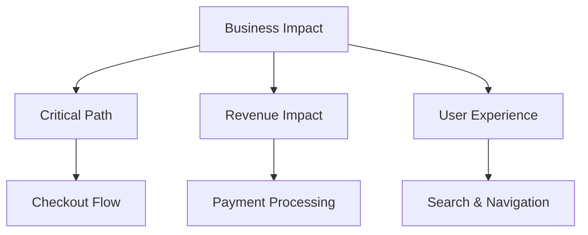

# Module 3: End-to-End Testing Strategies

## Modern E2E Testing Approach

End-to-end testing has evolved significantly with new tools, strategies, and AI integration. This module covers comprehensive approaches to E2E testing that ensure your e-commerce application works flawlessly from the user's perspective.

## Why E2E Testing Matters for E-Commerce

E-commerce applications have unique challenges:

- **Complex User Journeys** - Multiple steps from discovery to purchase
- **Payment Integration** - Critical financial transactions
- **Inventory Management** - Real-time stock updates
- **User Authentication** - Secure account management
- **Multi-device Experience** - Responsive design across devices

## Testing Strategy Framework

### 1. Risk-Based Test Prioritization

Focus testing effort on high-impact areas:



**High Priority:**

- User registration and authentication
- Product search and filtering
- Shopping cart operations
- Checkout and payment flow
- Order confirmation and tracking

**Medium Priority:**

- Product recommendations
- User profile management
- Wishlist functionality
- Product reviews and ratings

**Lower Priority:**

- Social sharing features
- Newsletter signup
- Advanced filtering options

### 2. Test Pyramid for E-Commerce

```
    🔺 E2E Tests (10-20%)
       - Critical user journeys
       - Payment workflows
       - Cross-browser scenarios

    🔹 Integration Tests (20-30%)
       - API contract testing
       - Database interactions
       - Third-party integrations

    🔲 Unit Tests (50-70%)
       - Component logic
       - Business rules
       - Utility functions
```

## AI-Enhanced E2E Testing

### Intelligent Test Case Generation

```javascript
// AI analyzes user behavior data to create realistic test scenarios
const userJourneyTests = await sparkAI.generateFromAnalytics({
  source: "google-analytics",
  timeRange: "last-30-days",
  includeAbandonmentPoints: true,
  generateRecoveryTests: true,
});

// Generated tests include:
// - Most common user paths
// - Abandonment recovery scenarios
// - Edge cases from real user data
```

### Dynamic Test Data Management

```javascript
// AI manages test data based on application state
const testDataStrategy = {
  products: await sparkAI.generateTestProducts({
    categories: ["electronics", "clothing", "books"],
    stockLevels: "varied",
    priceRanges: "realistic",
  }),
  users: await sparkAI.createTestUsers({
    personas: ["new-customer", "returning-customer", "vip-customer"],
    demographics: "representative",
  }),
};
```

## Core E2E Testing Patterns

### 1. Page Object Model Enhanced with AI

```javascript
// Traditional Page Object
class ProductPageTraditional {
  constructor(page) {
    this.page = page;
    this.addToCartBtn = '[data-testid="add-to-cart"]';
  }

  async addToCart() {
    await this.page.click(this.addToCartBtn);
  }
}

// AI-Enhanced Page Object
class ProductPageAI {
  constructor(page) {
    this.page = page;
    this.ai = new SparkAI(page);
  }

  async addToCart() {
    // AI finds the best selector strategy
    const button = await this.ai.findElement({
      intent: "add product to shopping cart",
      fallbackStrategies: ["data-testid", "aria-label", "button-text"],
    });
    await button.click();
  }

  async verifyProductAdded() {
    // AI validates multiple success indicators
    return await this.ai.waitForIntent({
      intent: "product successfully added to cart",
      indicators: ["cart-count-update", "success-message", "cart-animation"],
    });
  }
}
```

### 2. Comprehensive User Journey Testing

```javascript
// Complete Purchase Journey Test
test("Complete purchase journey - new customer", async ({ page }) => {
  const journey = new PurchaseJourney(page);

  // AI generates realistic test data
  const customer = await sparkAI.generateCustomer("new-user");
  const product = await sparkAI.selectProduct({
    category: "popular",
    inStock: true,
    priceRange: "medium",
  });

  await journey
    .visitHomepage()
    .searchForProduct(product.name)
    .selectProduct(product.id)
    .addToCart()
    .proceedToCheckout()
    .fillCustomerDetails(customer)
    .selectShipping("standard")
    .completePayment(customer.paymentMethod)
    .verifyOrderConfirmation();

  // AI validates entire flow
  await sparkAI.validateJourney({
    expectedOutcome: "successful-purchase",
    checkpoints: ["cart-updated", "payment-processed", "order-created"],
  });
});
```

### 3. Error Handling and Recovery Testing

```javascript
// AI-generated error scenarios
const errorScenarios = await sparkAI.generateErrorScenarios({
  contexts: ["checkout", "payment", "inventory"],
  severities: ["critical", "warning", "info"],
  recoveryTests: true,
});

test.describe("Error Handling", () => {
  errorScenarios.forEach((scenario) => {
    test(`Handle ${scenario.type} during ${scenario.context}`, async ({
      page,
    }) => {
      await scenario.setup(page);
      await scenario.triggerError();
      await scenario.verifyErrorHandling();
      await scenario.testRecovery();
    });
  });
});
```

## Advanced E2E Strategies

### 1. Visual Regression Testing with AI

```javascript
// AI-powered visual testing
test("Visual regression - product page", async ({ page }) => {
  await page.goto("/products/123");

  // AI identifies important visual elements
  const visualCheckpoints = await sparkAI.identifyVisualElements({
    importance: ["high", "medium"],
    types: ["layout", "content", "interactive-elements"],
  });

  // Compare with baseline using AI similarity
  await sparkAI.compareVisuals({
    checkpoints: visualCheckpoints,
    tolerance: "smart", // AI adjusts tolerance based on element type
    ignoreRegions: "dynamic-content",
  });
});
```

### 2. Performance Testing Integration

```javascript
// E2E + Performance testing
test("Checkout performance under load", async ({ page }) => {
  // Start performance monitoring
  await sparkAI.startPerformanceMonitoring({
    metrics: ["loadTime", "interactivity", "visualStability"],
    thresholds: "adaptive", // AI sets realistic thresholds
  });

  // Execute user journey
  await checkoutFlow.execute();

  // AI analyzes performance data
  const performanceReport = await sparkAI.analyzePerformance({
    compareBaseline: true,
    identifyBottlenecks: true,
    suggestOptimizations: true,
  });

  expect(performanceReport.score).toBeGreaterThan(85);
});
```

### 3. Cross-Browser and Device Testing

```javascript
// AI-optimized browser coverage
const browserStrategy = await sparkAI.optimizeBrowserCoverage({
  userAnalytics: "google-analytics-data",
  includeMinorBrowsers: false,
  mobileFirst: true,
});

// Adaptive test execution based on risk
browserStrategy.configs.forEach((config) => {
  test.describe(`${config.browser} - ${config.device}`, () => {
    test.use(config.settings);

    // AI selects critical tests for this combination
    const testSuite = sparkAI.selectTestsFor(config);
    testSuite.execute();
  });
});
```

## Exercise: Implementing Comprehensive E2E Tests

### Task 1: Set Up AI-Enhanced Page Objects

1. Create page objects for key e-commerce pages
2. Implement AI-powered element finding
3. Add intelligent waiting strategies

### Task 2: Build Complete User Journeys

1. Implement end-to-end purchase flow
2. Add error handling and recovery tests
3. Include performance validations

### Task 3: Advanced Testing Scenarios

1. Set up visual regression testing
2. Implement cross-browser test execution
3. Add mobile-specific test scenarios

## Best Practices for E2E Testing

### 1. Test Environment Management

```javascript
// Environment-aware configuration
const config = {
  staging: {
    paymentProvider: "sandbox",
    inventoryService: "mock",
    emailService: "test-mode",
  },
  production: {
    paymentProvider: "live",
    inventoryService: "live",
    emailService: "live",
    testDataCleanup: true,
  },
};
```

### 2. Test Data Strategy

- **Synthetic Data:** AI-generated realistic test data
- **Data Cleanup:** Automated cleanup after test execution
- **State Management:** Isolated test environments
- **Seed Data:** Consistent baseline data for tests

### 3. Parallel Execution and Optimization

```javascript
// AI-optimized test distribution
const executionPlan = await sparkAI.optimizeExecution({
  totalTests: 150,
  availableWorkers: 8,
  estimatedDuration: "15-minutes",
  dependencies: "auto-detect",
});

// Smart test ordering based on failure probability
await sparkAI.executeInOrder({
  strategy: "fail-fast",
  parallelization: "maximum-safe",
});
```

## Measuring E2E Testing Success

### Key Metrics

- **Coverage:** Critical user paths tested
- **Reliability:** Test flakiness and failure rates
- **Speed:** Test execution time and feedback loops
- **Business Impact:** Bugs caught vs. production issues

### AI-Driven Insights

- Identify test gaps and redundancies
- Predict test failures before execution
- Optimize test suite based on code changes
- Suggest new tests based on user behavior

## What's Next?

Now that we have comprehensive E2E testing in place, the next module will cover integrating these tests into modern CI/CD pipelines with intelligent automation and deployment strategies.

---

**Continue to:** [04-CI-CD-PIPELINE.md](./04-CI-CD-PIPELINE.md)
