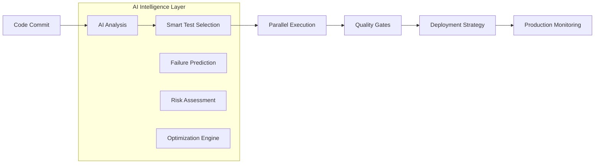

# Module 4: Modern CI/CD Pipeline Implementation

## The Evolution of CI/CD for Testing

Modern CI/CD pipelines have transformed from simple build-and-deploy scripts to intelligent, AI-powered systems that optimize testing strategies based on code changes, historical data, and business priorities.

## Pipeline Architecture Overview



## Key Components

### 1. Intelligent Trigger Management

Traditional approaches run all tests on every change. Modern pipelines use AI to determine optimal testing strategies:

```yaml
# .github/workflows/smart-testing.yml
name: Smart Testing Pipeline

on:
  push:
    branches: [main, develop]
  pull_request:
    branches: [main]

jobs:
  analyze-changes:
    runs-on: ubuntu-latest
    outputs:
      test-strategy: ${{ steps.ai-analysis.outputs.strategy }}
      risk-level: ${{ steps.ai-analysis.outputs.risk }}
    steps:
      - uses: actions/checkout@v3
        with:
          fetch-depth: 0 # Full history for AI analysis

      - name: AI Change Analysis
        id: ai-analysis
        uses: spark-ai/change-analyzer@v1
        with:
          analyze-impact: true
          historical-data: true
          risk-assessment: true
```

### 2. Dynamic Test Selection

```javascript
// AI-powered test selection
const testStrategy = await sparkAI.analyzeChanges({
  changedFiles: process.env.CHANGED_FILES?.split(",") || [],
  commitMessage: process.env.COMMIT_MESSAGE,
  authorHistory: process.env.AUTHOR_HISTORY,
  timeConstraints: process.env.TIME_BUDGET || "15m",
});

const selectedTests = await sparkAI.selectTests({
  strategy: testStrategy.recommendedStrategy,
  riskLevel: testStrategy.riskLevel,
  coverage: testStrategy.minCoverage,
});

console.log(`Selected ${selectedTests.length} tests based on AI analysis`);
```

## Multi-Stage Pipeline Implementation

### Stage 1: Fast Feedback Loop

```yaml
fast-feedback:
  runs-on: ubuntu-latest
  timeout-minutes: 5
  steps:
    - name: Install Dependencies
      run: npm ci --prefer-offline

    - name: AI-Selected Unit Tests
      run: |
        SELECTED_TESTS=$(spark-ai select-unit-tests \
          --changed-files="${{ github.event.pull_request.changed_files }}" \
          --max-duration=3m)
        npm test -- $SELECTED_TESTS

    - name: Lint and Type Check
      run: |
        npm run lint
        npm run type-check

    - name: Build Validation
      run: npm run build
```

### Stage 2: Integration Testing

```yaml
integration-tests:
  needs: fast-feedback
  runs-on: ubuntu-latest
  timeout-minutes: 10
  services:
    postgres:
      image: postgres:13
      env:
        POSTGRES_PASSWORD: test
      options: >-
        --health-cmd pg_isready
        --health-interval 10s
        --health-timeout 5s
        --health-retries 5
  steps:
    - name: AI-Optimized Integration Tests
      run: |
        # AI selects integration tests based on changed components
        TEST_SUITE=$(spark-ai select-integration-tests \
          --components="${{ needs.fast-feedback.outputs.changed-components }}" \
          --include-dependencies=true)

        npm run test:integration -- $TEST_SUITE
```

### Stage 3: End-to-End Testing

```yaml
e2e-tests:
  needs: integration-tests
  runs-on: ubuntu-latest
  timeout-minutes: 20
  strategy:
    matrix:
      browser: [chromium, firefox, webkit]
      # AI optimizes browser matrix based on usage data
      include: ${{ fromJSON(needs.analyze-changes.outputs.browser-matrix) }}
  steps:
    - name: Install Playwright
      run: npx playwright install ${{ matrix.browser }}

    - name: Smart E2E Test Execution
      run: |
        # AI determines critical E2E tests based on risk assessment
        CRITICAL_TESTS=$(spark-ai select-e2e-tests \
          --risk-level="${{ needs.analyze-changes.outputs.risk }}" \
          --browser="${{ matrix.browser }}" \
          --max-duration=15m)
          
        npx playwright test $CRITICAL_TESTS --browser=${{ matrix.browser }}

    - name: Upload Test Results
      uses: actions/upload-artifact@v3
      if: always()
      with:
        name: test-results-${{ matrix.browser }}
        path: test-results/
```

## Advanced Pipeline Features

### 1. Intelligent Test Parallelization

```javascript
// Smart test distribution across workers
const parallelizationStrategy = await sparkAI.optimizeParallelization({
  totalTests: testSuite.length,
  availableWorkers: process.env.WORKER_COUNT,
  testHistory: await getTestExecutionHistory(),
  dependencies: await analyzeTestDependencies(),
});

// Distribute tests optimally
const workerAssignments = parallelizationStrategy.distributeTests({
  strategy: "minimize-total-time",
  balanceLoad: true,
  respectDependencies: true,
});
```

### 2. Flaky Test Management

```yaml
flaky-test-handler:
  runs-on: ubuntu-latest
  steps:
    - name: Identify Flaky Tests
      run: |
        # AI identifies potentially flaky tests
        FLAKY_TESTS=$(spark-ai identify-flaky-tests \
          --history-days=30 \
          --confidence-threshold=0.7)
          
        echo "Flaky tests identified: $FLAKY_TESTS"

    - name: Execute with Retry Strategy
      run: |
        # Smart retry logic for identified flaky tests
        npx playwright test --retries=2 \
          --reporter=spark-ai-reporter \
          --flaky-test-handler=adaptive
```

### 3. Quality Gates with AI Insights

```yaml
quality-gates:
  needs: [fast-feedback, integration-tests, e2e-tests]
  runs-on: ubuntu-latest
  steps:
    - name: AI Quality Assessment
      id: quality-check
      run: |
        QUALITY_SCORE=$(spark-ai assess-quality \
          --test-results="${{ needs.e2e-tests.outputs.results }}" \
          --code-coverage="${{ needs.integration-tests.outputs.coverage }}" \
          --performance-metrics="${{ needs.e2e-tests.outputs.performance }}")
          
        echo "Quality score: $QUALITY_SCORE"
        echo "::set-output name=score::$QUALITY_SCORE"

    - name: Deployment Decision
      run: |
        if [ "${{ steps.quality-check.outputs.score }}" -lt "85" ]; then
          echo "Quality gate failed. Blocking deployment."
          exit 1
        else
          echo "Quality gate passed. Proceeding with deployment."
        fi
```

## Deployment Strategies

### 1. Progressive Deployment with Testing

```yaml
deploy-staging:
  needs: quality-gates
  runs-on: ubuntu-latest
  steps:
    - name: Deploy to Staging
      run: |
        # Deploy with feature flags for gradual rollout
        deploy-app --environment=staging \
          --feature-flags=progressive \
          --ai-monitoring=enabled

    - name: Smoke Tests in Staging
      run: |
        # AI-generated smoke tests for critical paths
        SMOKE_TESTS=$(spark-ai generate-smoke-tests \
          --deployment-context=staging \
          --critical-paths-only=true)
          
        npx playwright test $SMOKE_TESTS --base-url=${{ env.STAGING_URL }}

    - name: Production Readiness Check
      run: |
        READINESS_SCORE=$(spark-ai assess-production-readiness \
          --staging-results="${{ steps.smoke-tests.outputs.results }}" \
          --performance-baseline=true)
          
        if [ "$READINESS_SCORE" -ge "90" ]; then
          echo "::set-output name=ready-for-production::true"
        fi
```

### 2. Canary Deployment with Monitoring

```yaml
deploy-production-canary:
  needs: deploy-staging
  if: needs.deploy-staging.outputs.ready-for-production == 'true'
  runs-on: ubuntu-latest
  steps:
    - name: Canary Deployment
      run: |
        deploy-app --environment=production \
          --strategy=canary \
          --traffic-percentage=5 \
          --monitoring=enhanced

    - name: Canary Health Monitoring
      run: |
        # AI monitors canary metrics and user behavior
        spark-ai monitor-canary \
          --duration=30m \
          --success-criteria="error-rate<0.1%,response-time<500ms" \
          --auto-rollback=true
```

## Pipeline Observability and Analytics

### 1. Intelligent Monitoring

```javascript
// AI-powered pipeline monitoring
const pipelineMonitor = new SparkAI.PipelineMonitor({
  metrics: [
    "execution-time",
    "test-success-rate",
    "deployment-frequency",
    "lead-time-to-production",
  ],
  alerting: {
    anomalyDetection: true,
    predictiveAlerts: true,
    intelligentSuppression: true,
  },
});

// Monitor pipeline health
pipelineMonitor.trackExecution({
  pipelineId: process.env.GITHUB_RUN_ID,
  stage: "e2e-tests",
  duration: executionTime,
  success: testResults.success,
  metrics: testResults.metrics,
});
```

### 2. Performance Optimization Insights

```yaml
pipeline-optimization:
  runs-on: ubuntu-latest
  steps:
    - name: Analyze Pipeline Performance
      run: |
        # AI analyzes pipeline efficiency
        OPTIMIZATION_REPORT=$(spark-ai analyze-pipeline \
          --history-days=30 \
          --identify-bottlenecks=true \
          --suggest-optimizations=true)
          
        echo "Pipeline optimization suggestions:"
        echo "$OPTIMIZATION_REPORT"

    - name: Apply Optimizations
      run: |
        # AI can automatically apply safe optimizations
        spark-ai apply-optimizations \
          --auto-approve="caching,parallelization" \
          --require-approval="infrastructure,dependencies"
```

## Exercise: Building Your CI/CD Pipeline

### Task 1: Set Up Basic Pipeline

1. Create GitHub Actions workflow
2. Implement multi-stage testing
3. Add quality gates

### Task 2: Integrate AI Intelligence

1. Set up SPARK AI pipeline integration
2. Implement smart test selection
3. Add intelligent parallelization

### Task 3: Advanced Features

1. Configure flaky test management
2. Set up progressive deployment
3. Implement monitoring and alerting

## Best Practices

### 1. Security Integration

```yaml
security-scan:
  runs-on: ubuntu-latest
  steps:
    - name: AI-Enhanced Security Scanning
      run: |
        # AI identifies security-relevant changes
        SECURITY_SCOPE=$(spark-ai identify-security-changes \
          --changed-files="${{ github.event.pull_request.changed_files }}")
          
        # Run targeted security tests
        npm run security:scan -- $SECURITY_SCOPE
```

### 2. Cost Optimization

```yaml
cost-optimization:
  runs-on: ubuntu-latest
  steps:
    - name: Smart Resource Allocation
      run: |
        # AI optimizes resource usage based on workload
        RESOURCE_CONFIG=$(spark-ai optimize-resources \
          --workload-type="test-execution" \
          --time-constraints="${{ github.event.schedule }}" \
          --budget-constraints="${{ vars.CI_BUDGET }}")
          
        echo "Using optimized configuration: $RESOURCE_CONFIG"
```

### 3. Developer Experience

```yaml
developer-feedback:
  runs-on: ubuntu-latest
  steps:
    - name: Intelligent Test Summaries
      run: |
        # AI generates contextual feedback for developers
        FEEDBACK=$(spark-ai generate-feedback \
          --test-results="${{ steps.tests.outputs.results }}" \
          --author="${{ github.actor }}" \
          --change-context="${{ github.event.pull_request.title }}")
          
        # Post intelligent comments on PR
        gh pr comment --body "$FEEDBACK"
```

## Pipeline as Code Best Practices

### 1. Configuration Management

- Use infrastructure as code (IaC)
- Version control all pipeline configurations
- Implement configuration validation
- Use environment-specific parameters

### 2. Monitoring and Alerting

- Track pipeline performance metrics
- Set up intelligent alerting for failures
- Monitor resource utilization
- Implement cost tracking

### 3. Continuous Improvement

- Regular pipeline performance reviews
- A/B test pipeline optimizations
- Gather developer feedback
- Iterate based on AI insights

## What's Next?

With a robust CI/CD pipeline in place, the next module will dive into advanced testing topics including performance testing, accessibility validation, and specialized testing techniques for modern web applications.

---

**Continue to:** [05-ADVANCED-TESTING.md](./05-ADVANCED-TESTING.md)
